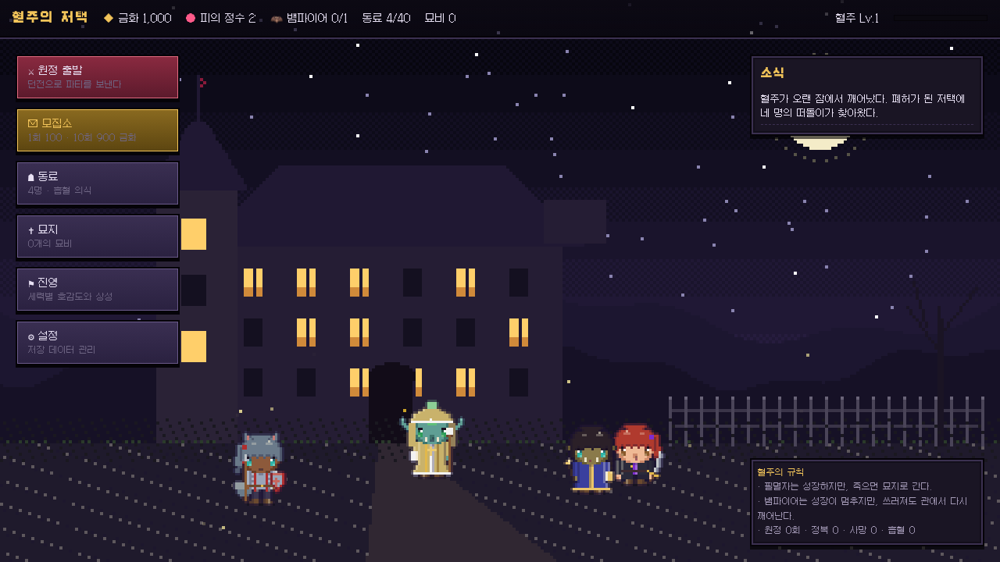
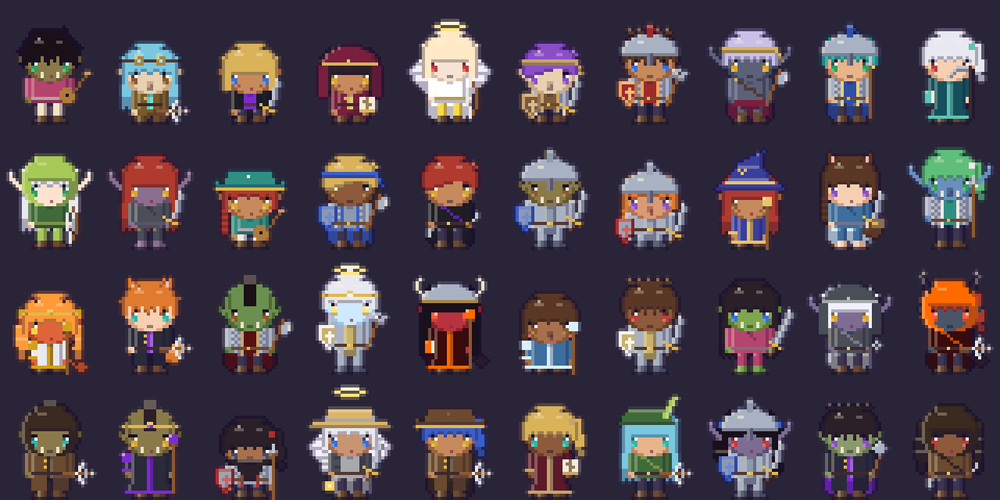
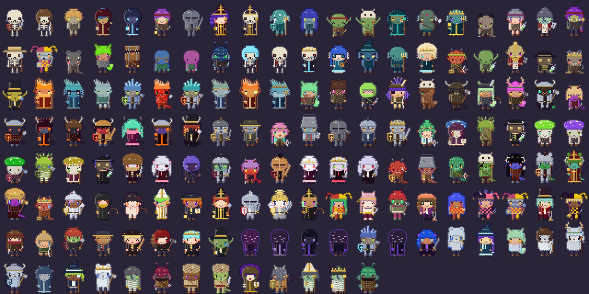
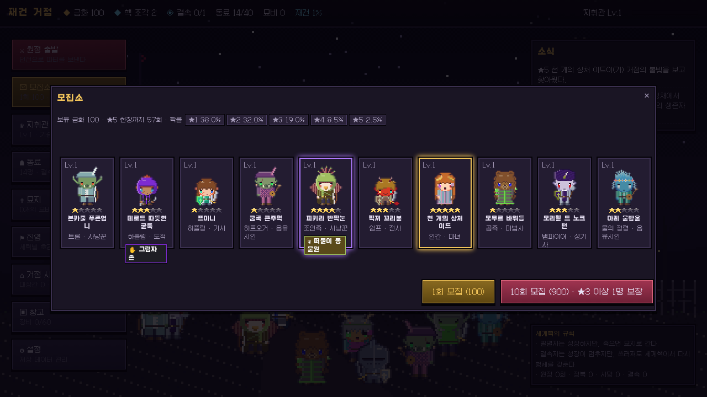
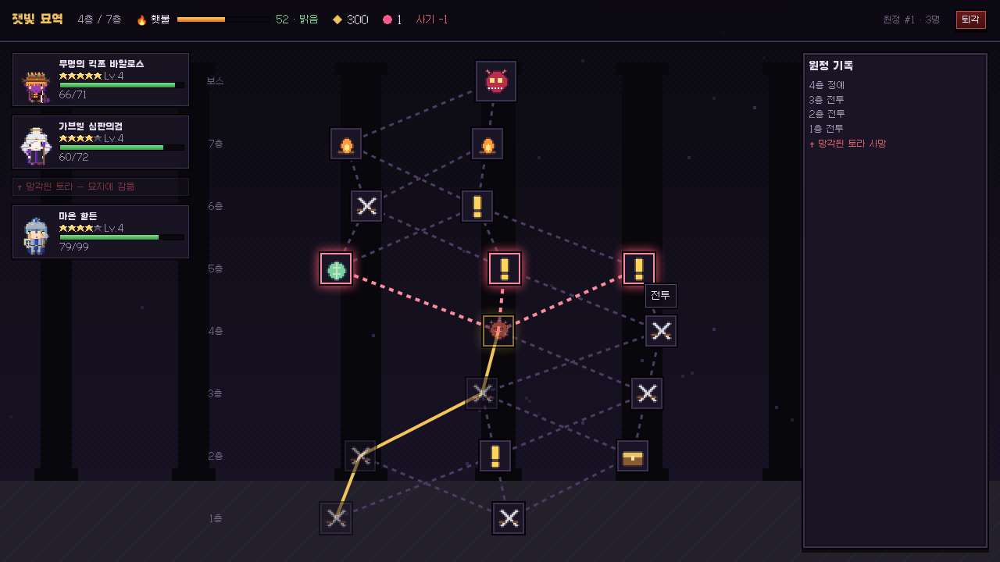
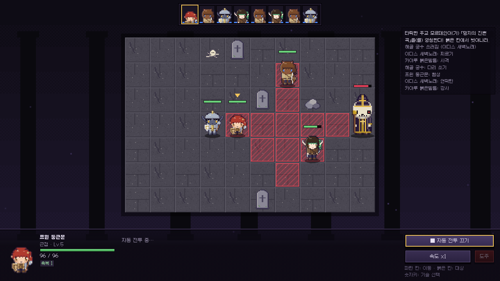
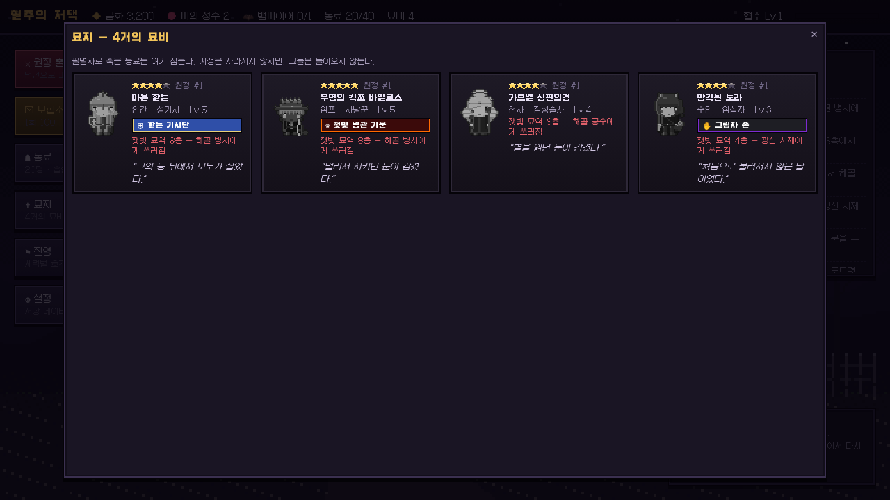
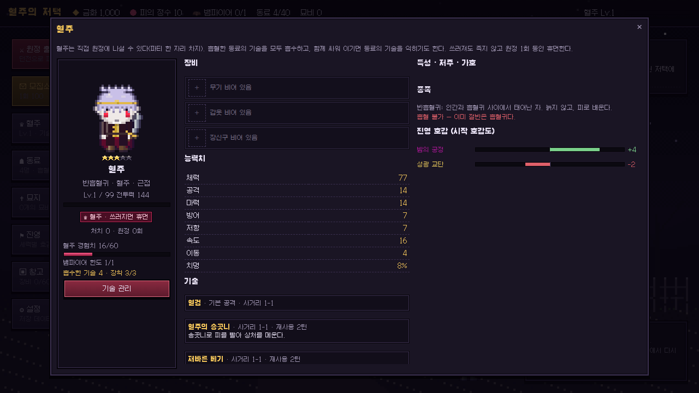
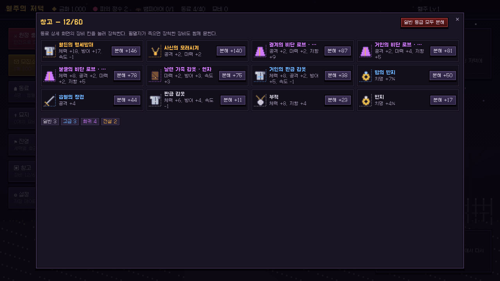

# World Aion — 혈주의 묘역

> 모든 동료가 무작위로 태어나는 픽셀 로그라이크 SRPG.
> '인간 혹은 뱀파이어'의 **필멸/불멸** 시스템, 다키스트 던전의 **묘지**, 그리고 완전 무작위 가챠.



## 실행

```bash
npm install
npm run dev        # http://localhost:5173
npm run build      # 타입체크 + 프로덕션 빌드 (dist/)
npm test           # 단위 테스트 (vitest)
```

진행 상황은 브라우저 `localStorage`에 자동 저장된다. 마을의 **설정 → 새 게임으로 초기화**로 처음부터 시작할 수 있다.

## 핵심 루프

1. **모집소**에서 금화로 동료를 모집한다 (1회 100 / 10회 900, ★3 이상 1명 보장, 60회 ★5 천장).
2. **원정 준비**에서 던전과 최대 4명의 파티를 고른다. **혈주** 본인도 한 자리를 차지해 출전할 수 있다. 파티원 간 **진영 상성**이 사기(±12%)를 정한다.
3. **던전 지도**에서 분기 경로를 고르며 내려간다. 이동할 때마다 **횃불**이 줄고, 어두울수록 기습·피해가 늘지만 전리품도 는다.
4. 노드: 전투 · 정예 · 사건 · 야영지 · 보물 · 떠돌이 상인 · 보스. 보물·정예·사건에서 **장비**와 원정 한정 **유물**을 얻는다.
5. **그리드 SRPG 전투**: 속도 기반 턴 순서, 이동 → 공격/기술, 상태이상, 범위기, 넉백, 자동 전투, 도주(보스 제외).
   보스와 정예는 **예고 공격**(붉은 칸에서 벗어나거나 기절로 끊기), **소환**, **페이즈**를 쓴다.
6. 귀환하면 금화·피의 정수·장비·구출한 동료를 정산한다. 전멸하면 전리품을 잃는다.

## 시스템

| 시스템 | 내용 |
|---|---|
| **혈주 (플레이어)** | 반흡혈귀 유닛으로 직접 출전. 흡혈한 동료의 기술을 모두 흡수하고, 함께 싸워 이기면 동료 기술을 익힌다(30%). 흡수한 기술 중 3개 장착. 쓰러지면 원정 1회 휴면. |
| **필멸자와 뱀파이어** | 필멸자는 레벨이 오르지만 죽으면 **묘지**로 간다. 혈주(플레이어)가 **흡혈 의식**으로 뱀파이어로 만들면 성장이 멈추는 대신 쓰러져도 관 속에서 휴면 후 돌아온다. 천사·신족·흡혈귀 사냥꾼은 흡혈 불가. |
| **묘지** | 사망한 동료의 사인, 장소, 특성 기반 묘비명이 남는다. 계정은 사라지지 않는다. 마을 배경의 묘비도 늘어난다. |
| **완전 무작위 동료** | 시드 하나로 종족(14) · 직업(28) · 성급 · 이름 · 외형 · 개체값 · 기술 · 특성/저주/가호가 결정된다. |
| **네임드 가문** | 13개 가문/집단. 종족·성급·직업·특성·**상태**(예: 뱀파이어)를 모두 만족해야 소속된다. 예) 할튼 기사단 = 인간 + ★3 + 기사 계열 + 맹세류 특성. |
| **특성 · 저주 · 가호** | 능력치, 경험치/금화 배율, 흡혈, 재생, 밤눈, 죽음 거부 등 효과와 **진영 호감도**를 바꾼다. |
| **장비** | 무기·갑옷·장신구 3칸. 등급(일반~전설)·접두어 옵션·이름이 무작위, 전설 7종은 고유 효과(보스 전용 드랍 포함). 필멸자가 죽으면 장비도 함께 묻힌다. 창고 60칸, 분해로 금화 회수. |
| **유물** | 원정 한정 파티 효과 14종 — 피 묻은 성배, 가시 갑옷 조각, 경계의 눈, 은빛 등불 등. |
| **보스 패턴** | 예고 공격(⚠ 붉은 빗금 범위, 기절로 영창 중단), 소환(☠), 체력 50% 페이즈(연출·강화·소환·기술 추가). |
| **진영** | 10개 세력과 상성표. 동료마다 시작 호감이 있고, 파티 내 화합/불화와 사건 선택지에 영향을 준다. |
| **절차적 픽셀아트** | 32×40 치비 스프라이트를 파츠(머리·헤어 13종·모자 19종·의상 13종·무기 20종·날개·뿔·꼬리·후광)로 조합, 자동 외곽선·셰이딩, 대기/공격/피격 5프레임 애니메이션. 이미지 파일 없이 시드로 다시 그린다. |




| 모집 | 지도 |
|---|---|
|  |  |
| **보스 예고 공격** | **묘지** |
|  |  |
| **혈주** | **창고** |
|  |  |

## 조작

- **지도**: 빛나는 노드를 클릭해 이동. 우상단 `퇴각`은 금화 절반만 들고 귀환.
- **전투**: 파란 칸 클릭 = 이동, 붉은/초록 칸 클릭 = 대상 지정. `1~5` 기술 선택, `Space` 대기, `Esc` 이동 취소. 자기 중심 기술은 버튼을 한 번 더 누르면 시전.
  붉은 **빗금** 칸은 적의 예고 공격 범위 — 다음 적 차례 전에 벗어나자.
- **장비**: 동료(또는 혈주) 상세 화면의 장비 칸 클릭 → 창고에서 고르기.
- 마우스를 올리면 유닛 정보와 예상 피해가 표시된다.

## 구조

```
src/
  core/            # 순수 게임 로직 (Phaser/DOM 의존 없음, 단위 테스트 대상)
    data/          # 종족·직업·스킬·특성·가문·진영·이름·적·던전·사건 데이터
    gen/           # 시드 기반 캐릭터·장비 생성기 (가문 조건 판정)
    battle/        # 그리드 전투 엔진(예고·소환·페이즈·유물 훅) + AI
    dungeon.ts     # 지도 생성, 횃불/어둠, 사건 조건
    state.ts       # 저장/불러오기 및 모든 계정·원정 행동
    vampire.ts     # 흡혈 규칙, 혈주 레벨
  art/             # 절차적 픽셀아트 (스프라이트, 타일, 배경, 이펙트)
  scenes/          # Phaser 씬 (마을 배경, 던전 배경, 전투)
  ui/              # DOM UI (마을·모집·동료·묘지·진영·원정·지도·전투 HUD)
tests/             # vitest
docs/GAME_DESIGN.md
```

데이터를 추가하려면 `src/core/data/`의 해당 파일에 항목을 넣으면 된다(예: 새 가문은 `houses.ts`에 조건과 특전만 정의).

## 크레딧

- 엔진: [Phaser 4](https://phaser.io) (MIT)
- 글꼴: [Galmuri](https://github.com/quiple/galmuri) by Lee Minseo (SIL OFL 1.1)
- 모든 캐릭터·타일·배경 그래픽은 코드로 생성된다.

자세한 설계와 수치는 [docs/GAME_DESIGN.md](docs/GAME_DESIGN.md) 참고.
