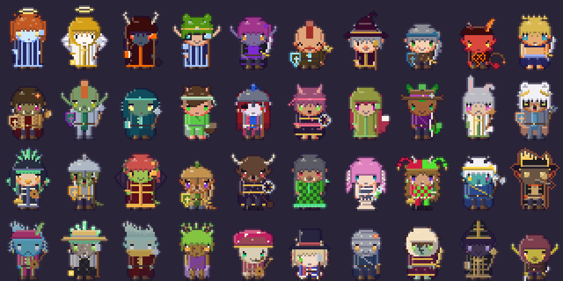
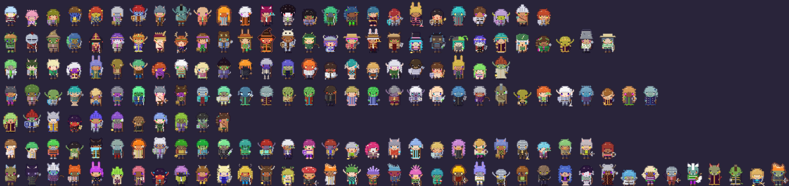
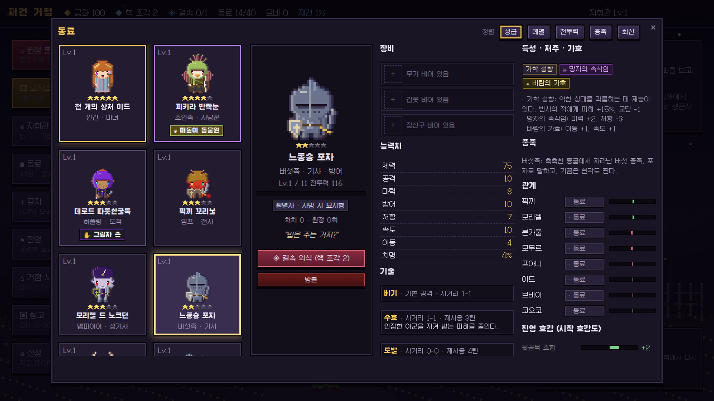
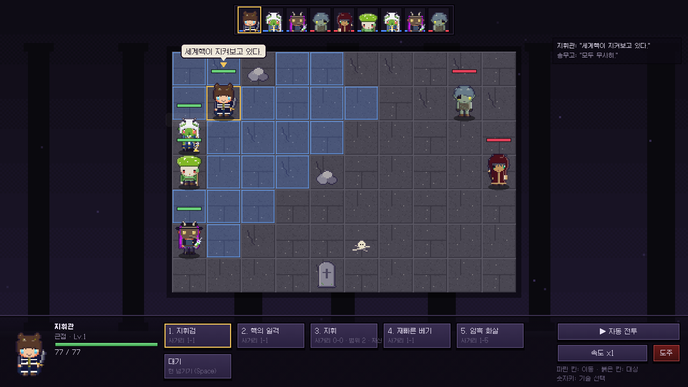
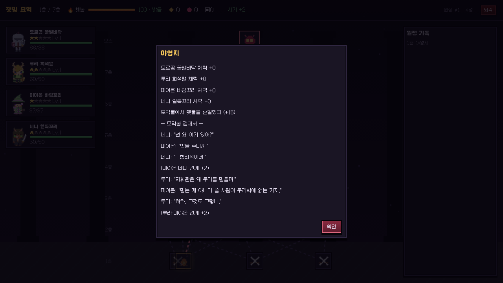
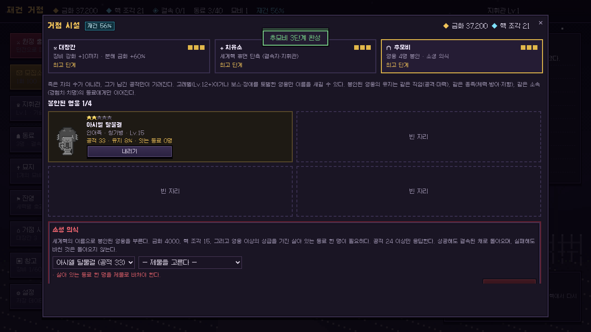
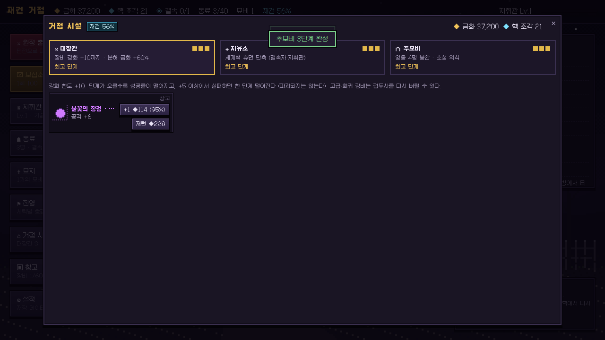

# World Aion — 재건의 지휘관

> 모든 동료가 무작위로 태어나는 픽셀 로그라이크 SRPG.
> 대붕괴로부터 백 년, 세계핵의 조각을 품은 **지휘관**이 무너진 성채에 생존자를 모아 폐허를 되찾는다.
> '인간 혹은 뱀파이어'의 **필멸/불멸** 선택, 다키스트 던전의 **묘지와 시설**, 그리고 완전 무작위 가챠.


## 실행

```bash
npm install
npm run dev        # http://localhost:5173
npm run build      # 타입체크 + 프로덕션 빌드 (dist/)
npm test           # 단위 테스트 (vitest)
```

진행 상황은 브라우저 `localStorage`에 자동 저장된다(이전 버전 저장도 자동 변환). 거점의 **설정 → 새 게임으로 초기화**로 처음부터 시작할 수 있다.

## 핵심 루프

1. **모집소**에서 금화로 동료를 모집한다 (1회 100 / 10회 900, ★3 이상 1명 보장, 60회 ★5 천장).
2. **원정 준비**에서 던전과 최대 4명의 파티를 고른다. **지휘관** 본인도 한 자리를 차지해 출전할 수 있다. 진영 상성과 **동료 관계**가 사기(±12%)를 정한다.
3. **던전 지도**에서 분기 경로를 고르며 내려간다. 이동할 때마다 **횃불**이 줄고, 어두울수록 기습·피해가 늘지만 전리품도 는다.
4. 노드: 전투 · 정예 · 사건 · 야영지(모닥불 대화) · 보물 · 떠돌이 상인 · 보스.
5. **그리드 SRPG 전투**: 속도 기반 턴, 이동 → 공격/기술, 상태이상, 끌어오기·자리바꿈·아군 소환, 자동 전투, 도주(보스 제외). 동료들은 상황마다 말풍선으로 한마디씩 한다.
6. 귀환하면 금화·핵 조각·장비·구출한 동료를 정산한다. 전멸하면 전리품을 잃는다.
7. 거점에서 **대장간·치유소·추모비**를 다시 짓고, 재건도를 올린다.

## 시스템

| 시스템 | 내용 |
|---|---|
| **지휘관 (플레이어)** | 핵지기 유닛으로 직접 출전. 결속한 동료의 기술을 모두 기록하고, 함께 싸워 이기면 동료 기술을 익힌다(30%). 기록한 기술 중 3개 장착. 쓰러지면 원정 1회 휴면. |
| **필멸자와 결속자** | 필멸자는 레벨이 오르지만 죽으면 **묘지**로 간다. **결속 의식**으로 세계핵에 묶으면 성장이 멈추는 대신 쓰러져도 휴면 후 돌아온다. 천사·신족·자동인형·흡혈귀 사냥꾼은 결속 불가. |
| **완전 무작위 동료** | 시드 하나로 종족(**40**) · 직업(**51**) · 성급 · 이름 · 외형 · 개체값 · 기술 · 특성/저주/가호가 결정된다. 정령, 수인 6종, 도깨비, 버섯족, 자동인형, 되살아난 자… 그리고 마약쟁이, 고문기술자, 광대, 고리대금업자, 역병의사, 주정뱅이, 백정, 무덤지기, 곡쟁이 같은 기괴한 직업까지. |
| **네임드 집단** | **49**개 가문·결사·조합. 종족·성급·직업·특성·상태를 모두 만족해야 소속된다. 집단마다 표어와 위계 호칭이 있다. 예) 할튼 기사단 = 인간 + ★3 + 기사 계열 + 맹세류 특성, 「방패는 나를 위해 들지 않는다」. 망나니 조합 = 처형인·백정·고문기술자 ★3, 「목은 하나, 실수는 없다」. |
| **동료 관계와 대사** | 모든 쌍에 맹우·전우·동료·앙숙·원수 관계. 진영·종족 관계·원한·직업 조합·같은 집단의 선후배로 시작해 함께 싸우고 모닥불 앞에서 대화하며 변한다. 맹우 옆에서는 더 세게 치고, 맹우가 쓰러지면 복수를 맹세한다. 51개 직업 전부에 고유 대사. |
| **거점 시설** | 대장간(강화 +10·재련·분해 보너스), 치유소(저주 정화·특성 치료·휴면 단축), 추모비(공적 있는 영웅만 1/2/4명 봉안, 같은 직업·종족·집단에게만 유지 전승, 극도로 어려운 소생 의식). |
| **묘지** | 사망한 동료의 사인, 장소, 특성 기반 묘비명이 남는다. 계정은 사라지지 않는다. |
| **장비 · 유물** | 장비 3칸, 등급·접두어·이름 무작위, 전설 7종, 대장간 강화. 원정 한정 유물 14종. |
| **보스 패턴** | 예고 공격(붉은 빗금, 기절로 영창 중단), 소환, 체력 50% 페이즈. |
| **진영** | 12개 세력과 상성표. 동료마다 시작 호감이 있고, 파티 사기와 사건 선택지에 영향을 준다. |
| **절차적 픽셀아트** | 32×40 치비를 파츠로 조합: 헤어 26 · 눈 7 · 입 6 · 의상 24(+무늬 7) · 모자 30 · 액세서리 16 · 무기 31 · 보조장비 12, 동물 귀·뿔·볏·피부 무늬·날개·꼬리, HSL 색 조화 규칙. 이미지 파일 없이 시드로 다시 그린다. |

**40개 종족** (종족당 무작위 1명)



**파츠 쇼케이스** — 헤어 26 · 모자 29 · 의상 24 · 무기 31 · 보조장비 11 · 액세서리/눈/입 · 종족 특징



| 모집 | 동료와 관계 |
|---|---|
|  |  |
| **전투 대사** | **보스 예고 공격** |
|  |  |
| **모닥불 대화** | **추모비** |
|  |  |
| **대장간** | **지휘관** |
|  |  |
| **지도** | **묘지** |
|  |  |

## 조작

- **지도**: 빛나는 노드를 클릭해 이동. 우상단 `퇴각`은 금화 절반만 들고 귀환.
- **전투**: 파란 칸 클릭 = 이동, 붉은/초록 칸 클릭 = 대상 지정. `1~5` 기술 선택, `Space` 대기, `Esc` 이동 취소. 자기 중심 기술은 버튼을 한 번 더 누르면 시전.
  붉은 **빗금** 칸은 적의 예고 공격 범위 — 다음 적 차례 전에 벗어나자. 맹우끼리는 붙여 세우고, 앙숙끼리는 떨어뜨리자.
- **장비**: 동료(또는 지휘관) 상세 화면의 장비 칸 클릭 → 창고에서 고르기. 강화는 **거점 시설 → 대장간**.
- 마우스를 올리면 유닛 정보·예상 피해·관계 이유가 표시된다.

## 구조

```
src/
  core/              # 순수 게임 로직 (Phaser/DOM 의존 없음, 단위 테스트 대상)
    data/            # 종족·직업·스킬·특성·집단·진영·이름·적·던전·사건·대사·시설 데이터
    gen/             # 시드 기반 캐릭터·장비 생성기 (집단 조건 판정)
    battle/          # 그리드 전투 엔진(예고·소환·페이즈·관계·대사 훅) + AI
    bond.ts          # 세계핵 결속 규칙, 지휘관 레벨
    relations.ts     # 동료 관계 점수 (진영·종족·원한·집단 위계·경험)
    dialogue.ts      # 상황별 대사·모닥불 대화 고르기
    facilities.ts    # 대장간·치유소·추모비 규칙
    dungeon.ts       # 지도 생성, 횃불/어둠, 사건 조건
    state.ts         # 저장/불러오기 및 모든 계정·원정·시설 행동
  art/
    parts/           # 스프라이트 파츠 (body·head·headgear·accessory·weapons)
    palette.ts       # HSL 색 조화·피부 톤 곡선
    charsprite.ts    # 파츠 합성 → 5프레임 시트
  scenes/            # Phaser 씬 (거점 배경, 던전 배경, 전투)
  ui/                # DOM UI (거점·모집·동료·묘지·진영·시설·원정·지도·전투 HUD)
tests/               # vitest (데이터 무결성·메커니즘·관계·시설 포함)
tests/tools/         # 미리보기 PNG·문서 표 생성기 (환경 변수로 켠다)
docs/GAME_DESIGN.md
```

데이터를 추가하려면 `src/core/data/`의 해당 파일에 항목을 넣으면 된다(예: 새 집단은 `houses.ts`에 조건·특전·표어만 정의). `tests/data.test.ts`가 모든 참조를 검사한다.

## 크레딧

- 엔진: [Phaser 4](https://phaser.io) (MIT)
- 글꼴: [Galmuri](https://github.com/quiple/galmuri) by Lee Minseo (SIL OFL 1.1)
- 모든 캐릭터·타일·배경 그래픽은 코드로 생성된다.

자세한 설계와 수치는 [docs/GAME_DESIGN.md](docs/GAME_DESIGN.md) 참고.
